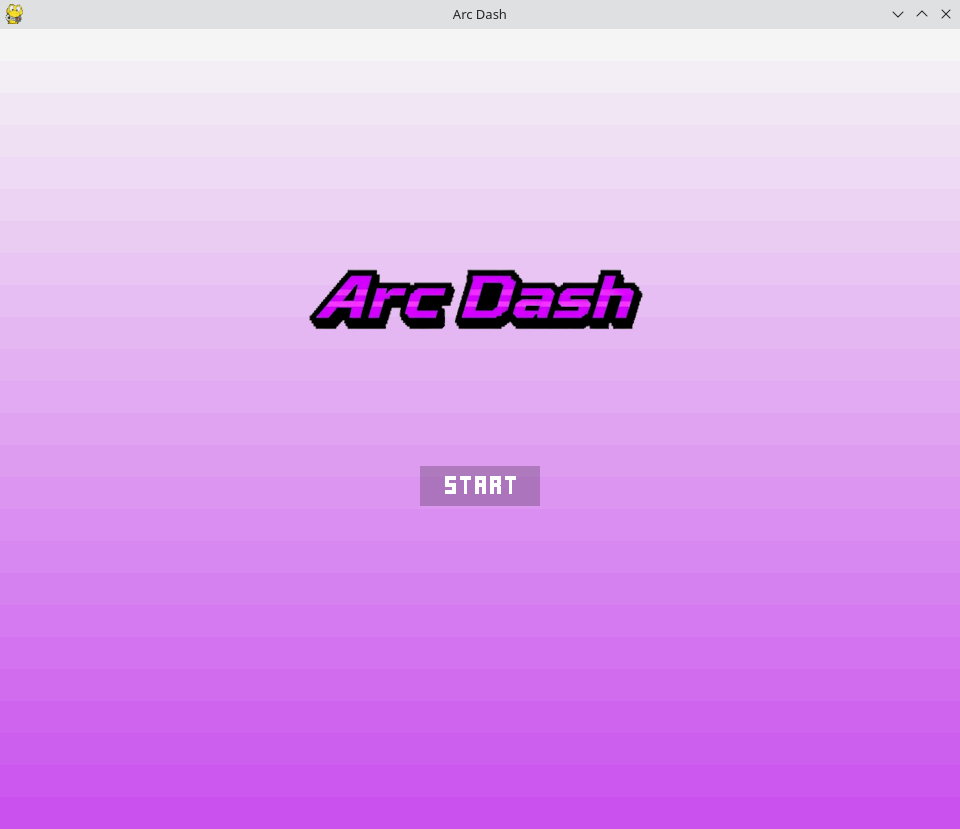
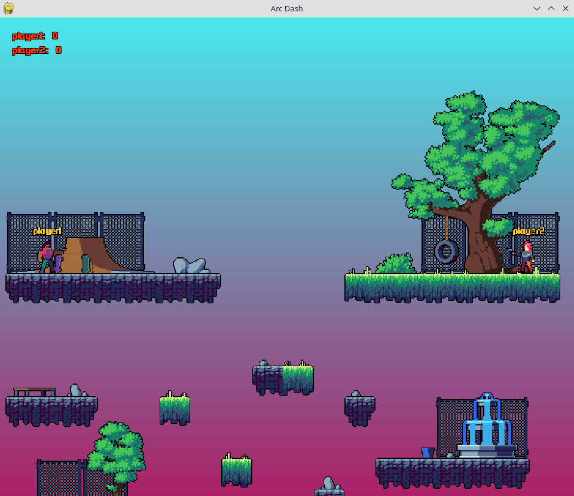
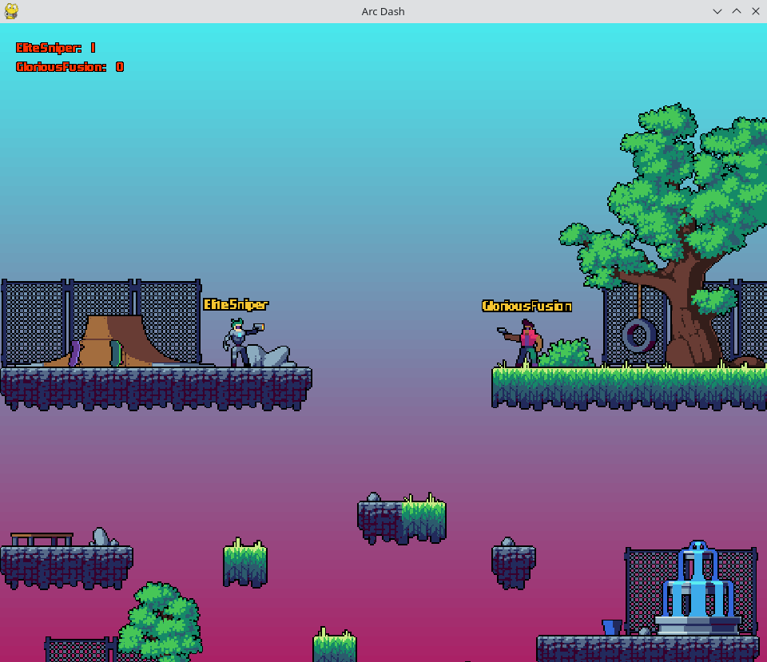
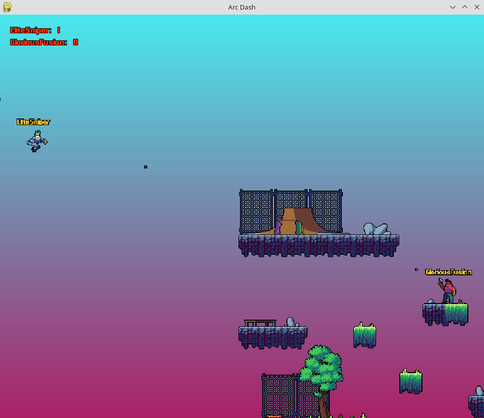

### Arc Dash is part of a first term university game project made by GloriousFusion (Loukas K.)

#### Notes:
- Run game through scripts/game.py
- Customize player settings in scripts/settings.py (controls included)
- Feel free to expand, contribute or recreate (check license for more information)

#### Preview:

  
  
  
  

#### Task List:
###### - Menus:
- [ ] Selection Menu (For managing settings)
- [ ] Menu Transitions
- [ ] Menu Resets

###### - Music:
- [ ] Menu Music
- [ ] Background Music

###### - Effects & Animations:
- [ ] Visual Effects
- [ ] Sound Effects
- [ ] Animated Objects

###### - Objects & Spawners:
- [ ] Collectable Weapons (Replacing current weapon)
- [ ] Collectable Boosters (Addition of stats for entity data)

###### - Entities:
- [ ] More States (Addition of other animations and abilities)
- [ ] Enemy AI (For singleplayer mode)

###### - Multiplayer:
- [ ] P2P / Hosting System

#### Credits:
##### Assets used:
- Assets including characters, maps, projectiles and weapons belong to craftpix.net
- More information here: https://craftpix.net/file-licenses/

- Assets including fonts belong to futuremillennium.com
- More information here: https://futuremillennium.com/fonts/

- Maps created using tiled map editor
- More information here: https://www.mapeditor.org/

- Logos created using deepai.org
- More information here: https://deepai.org/machine-learning-model/pixel-art-generator

##### Programming sources used:
- Super Pirate World: For Various Systems (Clear Code): https://github.com/clear-code-projects/Super-Pirate-World

- Pygame Cameras: For Camera Object (Clear Code): https://github.com/clear-code-projects/Pygame-Cameras

- Pygame Platformer Part 2: For Player Movement (KidsCanCode): https://github.com/kidscancode/pygame_tutorials/tree/master/platform/part%202

- Python Platformer: For Pixel Perfect Collision (Tech With Tim): https://github.com/techwithtim/Python-Platformer/tree/main

- ChatGPT: For Programming Partner (Open AI): https://openai.com/index/chatgpt/

#### License:

Shield: [![CC BY-NC 4.0][cc-by-nc-shield]][cc-by-nc]

This work is licensed under a
[Creative Commons Attribution-NonCommercial 4.0 International License][cc-by-nc].

[![CC BY-NC 4.0][cc-by-nc-image]][cc-by-nc]

[cc-by-nc]: https://creativecommons.org/licenses/by-nc/4.0/
[cc-by-nc-image]: https://licensebuttons.net/l/by-nc/4.0/88x31.png
[cc-by-nc-shield]: https://img.shields.io/badge/License-CC%20BY--NC%204.0-lightgrey.svg
